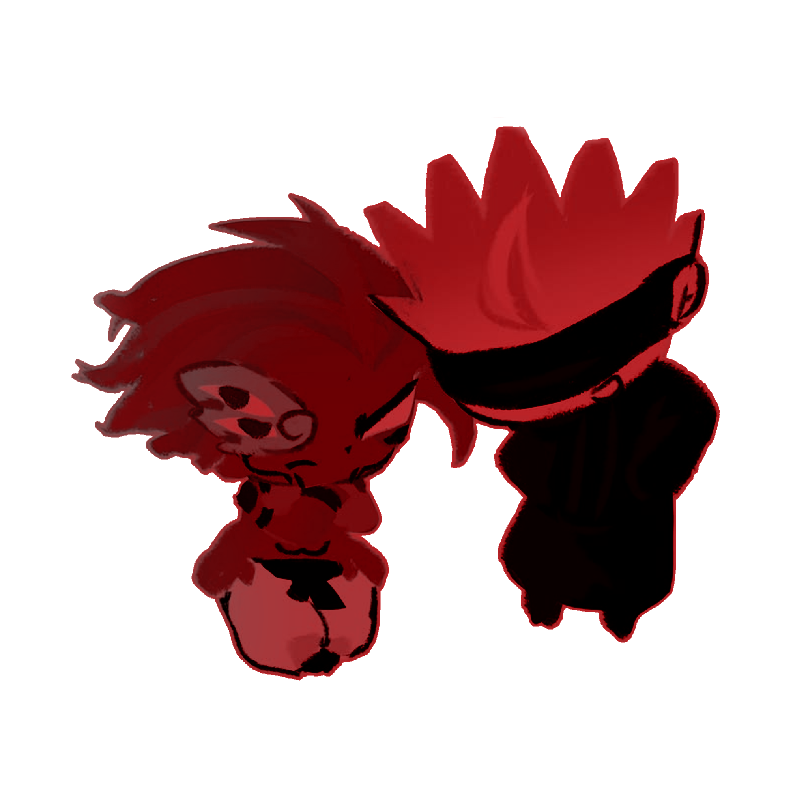

  

 

$\color{#BD0000}{\text{Ryomen Sukuna ︵ The King of Curses}}$
 
 
$\color{#910000}{\text{He . Him ⋮ C + H enc}}$
 
 
$\color{#730000}{\text{Wip , busy + kinda busy ? mostly s-afk or off-tab!}}$
 
 
$\color{#520000}{\text{w2i so i wont miss anything}}$

